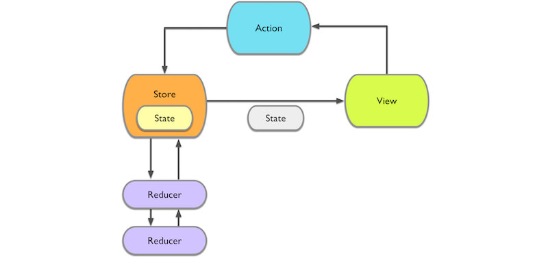

ReduxObjC
==========

Introduction
-------------

ReduxObjC is a [Redux](http://redux.js.org/docs/introduction/index.html)-like template of the unidirectional data flow architecture in Objective-C. ReduxObjC helps you to separate three important concerns of your app's components:

- **State**: The entire app state is explicitly stored in a data structure. This helps avoid complicated state management code, enables better debugging and has many, many more benefits...

- **Views**: Views update when state changes, so views become simple visualizations of the current app state.

- **State Changes**: State changes can only be performed through actions. Actions are small pieces of data that describe a state change. By drastically limiting the way state can be mutated, app becomes easier to understand and it gets easier to work with many collaborators.

ReduxObjC relies on a few principles:

- **The Store** stores entire app state in the form of a single data structure. This state can only be modified by dispatching Actions to the store. Whenever the state in the store changes, the store will notify all observers.

- **Actions** are a declarative way of describing a state change. Actions don't contain any code, they are consumed by the store and forwarded to reducers. Reducers will handle the actions by implementing a different state change for each action.

- **Reducers**, unlike original Redux definition, are impure functions. Reducer gets action and current state, then _mutates_ state directly for performance concern.



Implementation Detail
----------------------

There are four components in ReduxObjC, they are `RDXAction`, `RDXState`, `RDXReducer`, and `RDXStore`. In order to give you more flexibility and not to affect your existing source codes, the first three components are just protocol definitions.

### RDXAction

```objective-c
@protocol RDXAction
/**
 * The action identifier. Each action should has unique identifier.
 */
@property (nonatomic, copy, readonly) NSString *identifier;
/**
 * Extra information attached to this action.
 */
@property (nonatomic, strong, readonly, nullable) id payload;
@end
```

### RDXState

```objective-c
/**
 * In order to deep copy the state via
 * `[NSKeyedUnarchiver unarchiveObjectWithData:[NSKeyedArchiver archivedDataWithRootObject:state]]`,
 * the `RDXState` protocol needs to conform to `<NSCoding> protocol.
 */
@protocol RDXState <NSCoding>
@end
```

### RDXReducer

```objective-c
typedef void (^RDXReduceBlock)(id <RDXState> state, id <RDXAction> action);
@protocol RDXReducer
/**
 * Returns an array of reducer blocks.
 * @return An array of `RDXReduceBlock`s.
 */
+ (NSArray <RDXReduceBlock> *)reducers;
@end
```

### RDXStore

The `RDXStore` component is ready for you to do all the heavy liftings, you have to initialize this component with reduce blocks and initial state.

```objective-c
/**
 * Creates a store object with an array of `RDXReduceBlock`s and an initial state.
 *
 * @param reducers An array of reduce blocks.
 * @param initialState Initial state.
 * 
 * @return A store object.
 */
- (instancetype)initWithReducers:(NSArray <RDXReduceBlock> *)reducers state:(id <RDXState> )initialState NS_DESIGNATED_INITIALIZER;
```

You dispatch a `RDXAction` object to it later on, and it passes current state and the action object to all reduce blocks.

```objective-c
/**
 * Asks the receiver to dispatch an action and returns immediately.
 * The receiver passes current state and the action object to all reduce blocks.
 * After all reduce blocks are invoked, notification named `RDXStateDidChangeNotification` is sent, the sender is the store object and the userInfo is `nil`.
 *
 * @param action The action object to be dispatched.
 */
- (void)dispatchAction:(id <RDXAction> )action;
```

After all reduce blocks are invoked, a notification named `RDXStateDidChangeNotification` is sent. You can ask the store for current state and then update the UI or do something else based on the state.

```objective-c
/**
 * Asks the receiver for current state.
 *
 * @return A deep copy instance of current state.
 */
- (id <RDXState> )currentState;
```

Best Practice
--------------

Because each projects and their business logics are different, you have to implement your own **Action**, **Reducer**, and **State** objects and conform to `<RDXAction>`, `<RDXReducer>`, and `<RDXState>` protocols respectively.

You are encouraged to implement your own **Store** object which is a subclass of `RDXStore` and provide a class method that returns a shared singleton object. This object is responsible to collect all reduce blocks and retrieve initial state in the `init` method, and save current state at the right time if necessary.

```objective-c
/*
 * Store.h
 */
@interface Store : RDXStore
@end

/*
 * Store.m
 */
@implementation Store
+ (instancetype)sharedStore {
    static id _sharedStore = nil;
    static dispatch_once_t onceToken;
    dispatch_once(&onceToken, ^{
        _sharedStore = [[self alloc] init];
    });

    return _sharedStore;
}

- (instancetype)init {
    NSArray *reducers = ...;
    State *initialState = ...;

    self = [super initWithReducers:reducers state:initialState];
    if (self) {
        // ...
    }
    return self;
}
@end
```

Reference
----------

- [Redux](http://redux.js.org/docs/introduction/index.html)
- [ReSwift](https://github.com/ReSwift/ReSwift)
- [Real World Flux Architecture on iOS](http://blog.benjamin-encz.de/post/real-world-flux-ios/)
- [Watch Managing Consistency of Immutable Models](https://news.realm.io/news/slug-peter-livesey-managing-consistency-immutable-models/)
- [Immutable models and data consistency in our iOS App](https://medium.com/@Pinterest_Engineering/immutable-models-and-data-consistency-in-our-ios-app-d10e248bfef8)
